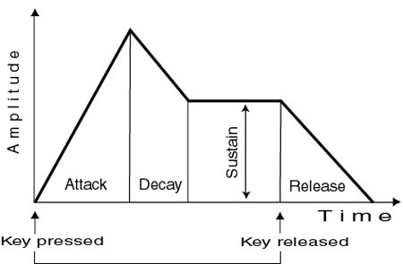

# Documentation général

- [Documentation général](#documentation-général)
  - [Explications des paramètres principaux](#explications-des-paramètres-principaux)
    - [1. Buffers audio (`left_buffer`, `right_buffer`)](#1-buffers-audio-left_buffer-right_buffer)
    - [2. Amplitude (`amp`)](#2-amplitude-amp)
    - [3. Temps (`t1`, `t2`, `dt`)](#3-temps-t1-t2-dt)
    - [4. Méthodes de création d'un accord](#4-méthodes-de-création-dun-accord)
      - [Méthode 1 : Superposition](#méthode-1--superposition)
      - [Méthode 2 : Accord enrichi](#méthode-2--accord-enrichi)
      - [Méthode 3 : Synthèse additive enrichie](#méthode-3--synthèse-additive-enrichie)
  - [Fonctions principales de la lib musique](#fonctions-principales-de-la-lib-musique)
    - [note\_to\_frequency](#note_to_frequency)
      - [Paramètres](#paramètres)
      - [Valeur de retour](#valeur-de-retour)
      - [Exemple](#exemple)
    - [generate\_chord](#generate_chord)
      - [Paramètres de generate\_chord](#paramètres-de-generate_chord)
      - [Retour (generate\_chord)](#retour-generate_chord)
      - [Exemple d'accord](#exemple-daccord)
    - [generate\_envelope](#generate_envelope)
      - [Paramètres de generate\_envelope](#paramètres-de-generate_envelope)
      - [Retour (generate\_envelope)](#retour-generate_envelope)
      - [Exemple ADSR](#exemple-adsr)
    - [init\_audio\_buffers](#init_audio_buffers)
      - [Paramètres de init\_audio\_buffers](#paramètres-de-init_audio_buffers)
      - [Comportement](#comportement)
      - [Exemple d'initialisation](#exemple-dinitialisation)
    - [free\_audio\_buffers](#free_audio_buffers)

## Explications des paramètres principaux

Cette section explique en détail les paramètres principaux utilisés dans la génération audio, leur rôle et leur portée et comment les utiliser correctement dans la librairie.

### 1. Buffers audio (`left_buffer`, `right_buffer`)

**Type** : `double *`  

**Description :**

Un buffer audio est une zone mémoire temporaire qui contient les valeurs représentant un signal audio dans le temps. C'est dans ces buffers que l'on stocke le son avant de l'écrire dans un fichier WAV.

Chaque case du tableau représente un échantillon du signal à un instant donné et pour un canal donné (gauche, droit, ...).

**Résumé :**

- Zones mémoire où sont écrits les signaux générés.
- Chaque case correspond à un échantillon sonore.
- En stéréo, deux buffers ; en mono, les deux pointent sur le même bloc.

**Remarques :**

- Ne jamais écrire sans initialiser (via `init_audio_buffers`)
- Toujours libérer après (`free_audio_buffers`)

---

### 2. Amplitude (`amp`)

**Type** : `double`  

**Description :**

- Contrôle l’intensité sonore du signal ajouté dans le buffer.
- Doit être **inférieur ou égal à 32767** pour éviter les dépassements lors de l’écriture en 16-bit PCM.

**Valeurs :**

- Pour une note isolée : `amp ≈ 3000`
- Pour un accord de 3 notes : `amp ≈ 1000–3000`, divisé par `count`
- Trop grand → clipping, saturation
- Trop petit → inaudible

**Infos supplémentaires :**

- `amp` agit **avant la normalisation**
- On peut accumuler plusieurs signaux si on normalise à la fin

---

### 3. Temps (`t1`, `t2`, `dt`)

**Type** : `double` (secondes)

**Description :**

- Délimitent la zone temporelle d’un signal dans le buffer.
- Convertis en index avec `i = t * sample_rate`.

**Remarques :**

- Tous les signaux doivent être correctement placés dans la timeline.
- `generate_chord(1.0, 2.0, ...)` écrit entre les échantillons 44100 et 88200 à 44.1 kHz

---

### 4. Méthodes de création d'un accord

Voici 3 méthodes différentes de superposer des fréquences / notes dans un buffer audio.

#### Méthode 1 : Superposition

La superposition consiste à appeler plusieurs fois une fonction de génération (comme `generate_signal`), avec les mêmes `t1` et `t2`

```c
generate_signal(t1, t2, 220);
generate_signal(t1, t2, 277);
generate_signal(t1, t2, 330);
```

- Méthode très flexible : chaque note peut avoir un volume, une enveloppe et une durée différente
- Risque d'oublier de diviser `amp` et donc avoir du clipping
- Plus difficile a automatiser (pas de structure d'accord réelle)

#### Méthode 2 : Accord enrichi

On utilise une fonction dans laquelle on passe en paramètre un tableau de fréquences, une amplitude et un intervalle de temps. La solution est compacte, intègre une synthèse additive pour chaque fréquence et répartis l'amplitude correctement  en fonction du nombre de notes dans l'accord (`amp / count`).

```c
double freqs[] = {220, 277, 330};
generate_chord(t1, t2, freqs, 3, amp, rate);
```

#### Méthode 3 : Synthèse additive enrichie

On code une fonction personnalisée qui génère l'accord en superposant plusieurs sinusoïdes enrichies. Ou plus simplement on construit l'accord mathématiquement dans une fonction.

```c
for (j = 1; j <= 7; j++) {
    sample += sin(j * omega * t)
            + sin(j * omega * ratio1 * t)
            + sin(j * omega * ratio2 * t);
}
```

On a donc un accord créé comme étant une seule entité harmonique, avec un timbre riche, naturel et plus organique. La méthode est très efficace pour un son de synthèse propre.

> Pour l'instant on manque de contrôle sur cette méthode, donc elle n'est pas implémentée correctement.

## Fonctions principales de la lib musique

### note_to_frequency

```c
double note_to_frequency(const char *note_name, int octave);
```

**Description :**  
Convertit un nom de note musicale et une octave en sa fréquence en Hz, selon le système tempéré égal basé sur A4 = 440 Hz.

Cette fonction est utile pour générer des notes précises dans des buffers audio ou construire des accords.

#### Paramètres

| Nom | Type | Description |
|-|-|-|
| `note_name` | `const char *` | Nom de la note parmi : `"C"`, `"C#"`, `"D"`, `"D#"`, `"E"`, `"F"`, `"F#"`, `"G"`, `"G#"`, `"A"`, `"A#"`, `"B"` |
| `octave` | `int` | Numéro de l’octave (ex : 4 pour A4 = 440 Hz) |

#### Valeur de retour

- Retourne la fréquence de la note en Hz si la note est valide.
- Retourne `-1.0` si la note n’est pas reconnue.

#### Exemple

```c
double a = note_to_frequency("A", 4);    // 440.0
double cs = note_to_frequency("C#", 4);  // 277.18
double err = note_to_frequency("H", 4);  // -1.0
```

---

### generate_chord

```c
void generate_chord(double t1, double t2, const double *frequencies, int count, double amp, int sample_rate);
```

**Description :**  
Génère un accord à partir d’un tableau de fréquences représentant les notes. Chaque note est enrichie par synthèse additive avec plusieurs harmoniques, et les signaux sont additionnés dans les buffers audio gauche et droit.

Cette fonction permet de créer des accords riches et complexes entre deux instants donnés.

#### Paramètres de generate_chord

| Nom | Type | Description |
|-|-|-|
| `t1` | `double` | Temps de début de l'accord, en secondes |
| `t2` | `double` | Temps de fin de l'accord, en secondes |
| `frequencies` | `const double *` | Tableau des frequences (en Hz) des notes à superposer |
| `count` | `int` | Nombre de freq. dans le tableau (nb de notes de l'accord) |
| `amp` | `double` | Amplitude globale (répartie sur les notes de l'accord) |
| `sample_rate` | `int` | Taux d'échantillonage en Hz (ex: 44100) |

#### Retour (generate_chord)

- Aucun retour. Les signaux sont ajoutés dans les buffers audio globaux.

#### Exemple d'accord

```c
double freqs[] = {261.63, 329.63, 392.00}; // Do, Mi, Sol
generate_chord(0.0, 2.0, freqs, 3, 3000.0, 44100);
```

---

### generate_envelope

```c
void generate_envelope(double t1, double t2, double attack, double decay, double sustain, double release, int sample_rate);
```

**Description :**  
Applique une enveloppe ADSR (Attack, Decay, Sustain, Release) sur la plage temporelle donnée dans les buffers audio. Cette enveloppe module progressivement l’amplitude du signal, rendant le son plus naturel.

#### Paramètres de generate_envelope

| Nom | Type | Description |
|-|-|-|
| `t1` | `double` | Temps de début de l'enveloppe, en secondes |
| `t2` | `double` | Temps de fin de l'enveloppe, en secondes |
| `attack` | `double` | Pourcentage de la durée affecté à l'attaque |
| `decay` | `double` | Pourcentage de la durée affecté à la dércoissance |
| `sustain` | `double` | Niveau de maintien (pourcentage de l'amplitude max) |
| `release` | `double` | Pourcentage de la durée affecté au relâchement |
| `sample_rate` | `int` | Taux d'échantillonage en Hz (ex: 44100) |

#### Retour (generate_envelope)

- Aucun retour. L'amplitude des échantillons est modifiée directeent dans les buffers audio.

#### Exemple ADSR

```c
generate_envelope(0.0, 3.0, 10.0, 20.0, 70.0, 10.0, 44100);
```

Valeurs typiques :

- Attack (durée %) : 0-30
- Decay (durée %) : 0-40
- Sustain (niveau %) : 30-100
- Release (durée %) : 0-40



---

### init_audio_buffers

```c
void init_audio_buffers(int sample_rate, int num_channels, double duration_sec);
```

**Description :**  
Alloue dynamiquement les buffers audio `left_buffer` et `right_buffer` pour stocker des échantillons audio en virgule flottante (double). La taille dépend du taux d’échantillonnage, du nombre de canaux et de la durée en secondes.

Cette fonction doit être appelée **avant toute génération de signal**.

#### Paramètres de init_audio_buffers

| Nom | Type | Description |
|-|-|-|
| `sample_rate` | `int` | Fréquence d'échantillonage en Hz (ex: 44100) |
| `num_channels` | `int` | 1 pour mono, 2 pour stéréo |
| `duration_sec` | `double` | Durée totale du signal en secondes |

#### Comportement

- En mode mono (num_channels == 1), `right_buffer` pointe sur `left_buffer`
- En mode stéréo, deux buffers indépendants sont alloués
- Les buffers sont initialisés à 0
- Définit la variable globale `total_samples`

#### Exemple d'initialisation

```c
init_audio_buffers(44100, 2, 5.0);  // 5 secondes en stéréo à 44.1 kHz
```

---

### free_audio_buffers

```c
void free_audio_buffers(void);
```

**Description :**
Libère proprement la mémoire allouée pour les buffers audio. Si left_buffer et right_buffer sont identiques (cas du mono), un seul free() est effectué. Cette fonction doit être appelée après l’écriture dans le fichier WAV.

---
