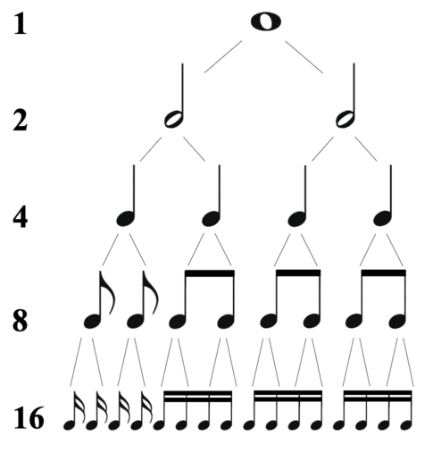

# Notions Musicales

**Le plus simple : aller voir sur [apprendrelesolfege.com](https://www.apprendrelesolfege.com) et [Wikipedia](https://fr.wikipedia.org/wiki/Mesure_(musique)). Il y a toutes les infos nécessaires sur ces deux sites.**

## Rythmique

### Courte Introduction

Un **temps** est une division régulière du temps musical (comme les secondes dans une horloge), sur lesquels se calquent les notes.

Une **mesure** est une unité rythmique contenant un certain nombre de **temps**.

Le **tempo** correspond a la vitesse de la musique, il est mesuré en **battements par minute (BPM)**. Un tempo de 60 BPM signifie donc 1 battement par seconde.

### Chiffrage de mesure

Le **chiffrage de mesure** ou **signature rythmique** permet d'indiquer le nombre de subdivisions qu'il y a par mesure. On a dans l'image suivante la répartition des subdivisions. On note donc qu'une ronde vaut 1, une blanche vaut 2, une noire 4...



Donc quand on écris 2/4 on indique qu'il y a 2 noires par mesure. Si on marque 7/16 on a 7 double croche par mesure.

Informations complémentaires :

- <https://www.apprendrelesolfege.com/chiffrage-de-mesure>
- <https://fr.wikipedia.org/wiki/Mesure_(musique)>

### Calculs du temps total du morceau

> BPM = 140
7/8 -> 7 croches par mesure
donc ici: 1 temps = 1 croche
>
> 1 mesure = 7 croches = 7*1 temps = 7 battements à 140 BPM pour 1 mesure = 7/140 secondes par mesure
>
> -> avec ça on peut avoir le temps total du morceau en fonction du nombre total de mesures.

On prend par exemple la signature 7/8 et 120 BPM

- Il y a 7 croches par mesure
- La croche (1/8) est l'unité de temps (1 croche = 1 battement)

On a donc 120 croches par minute.
Et 1 croche dure $1/120$ minutes = $1/120\times60$ secondes.
Donc 7 croches (= 1 mesure) durent $7/120\times60$ secondes.
On peut donc écrire la formule suivante :

Durée Totale = $(nb\_mesures \times numerateur \times \frac{60}{BPM})$ secondes.

On peut écrire la fonction suivante :

```c
double duree_totale(double bpm, int numerateur, int nb_mesures) {
    return nb_mesures * numerateur * (60 / bpm);
}
```
